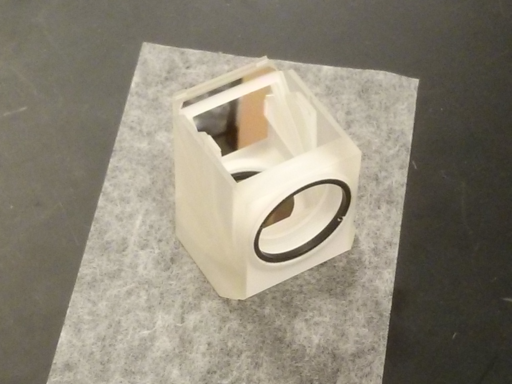

Filter cube for a Nikon TiU microscope, fits both Olympus and Nikon style dichroics. Works, but the fit into the filter wheel is sometimes a bit tight.

Notes:
* The tolerances on this part are quite high (~ 0.1mm), particularly for the SM1 thread for the excitation filter. You will need a high quality 3D printer to make this.
* You will need an SM1 threaded ring to hold an excitation filter.
* It costs about $50 to have [Shapeways](http://www.shapeways.com/) print this for you in their [Frosted Ultra Detail](http://www.shapeways.com/materials/frosted-detail-plastic?li=nav) material.
* The part from Shapeways will need to be cleaned by sonication in Ethanol to remove residual oils.

OpenSCAD Rendering:

Pictures: (Shapeways Frosted Ultra Detail):

