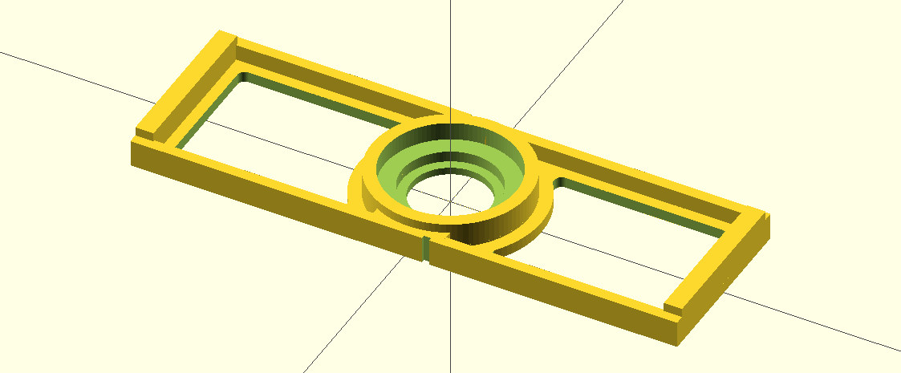
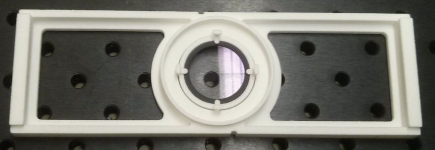

Holds a 1" filter in the slot under the turret of a Nikon TiU microscope.

Notes:
* The ring that holds the filter can be too tight depending on the print. Some redesign needed..
* It costs about $20 to have [Shapeways](http://http://www.shapeways.com/) print this for you in their *Strong and Flexible Plastic* material.

OpenSCAD Rendering:

Picture (Shapeways Strong and Flexible, White, unpolished):

