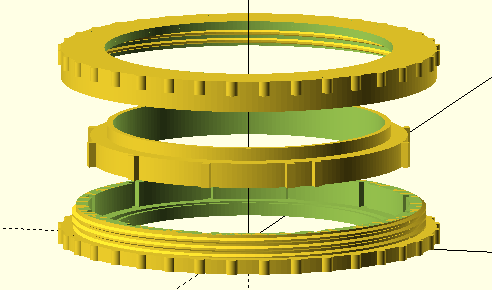
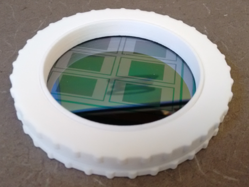

A jig for casting PDMS on a 3" wafer. With this jig you don't have to worry about the PDMS running under the wafer. You do however have to worry about dust as it will shed a bit of material, particularly when it is new.

Notes:
* It costs about $30 to have [Shapeways](http://http://www.shapeways.com/) print this for you in their *Strong and Flexible Plastic* material.
* You will also need 2x 2mm thick x 65mm diameter buna O-rings.

OpenSCAD Rendering:

Picture (Shapeways Strong and Flexible, White, polished):

