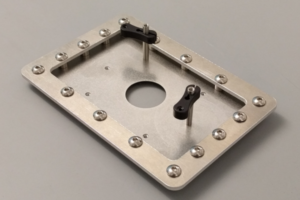

Adaptable stage plate that should fit in most motorized stages.

Notes:
* You will need a 5mm tap, 5mm bolts, probably some spacers and also some patience to tap all the holes.
* You will need a 6-32 tap.
* We use [Thorlabs](https://www.thorlabs.com/) PM3 or PM4 for the clamps.
* It costs about $140 to make 5x of al_plates in Al 6061, 0.125" thick, normal taper, basic finish at [Big Blue Saw](https://www.bigbluesaw.com/).
* It costs about $120 to make 5x of ss_plate in SS T-304, 0.018" thick, normal taper, basic finish at [Big Blue Saw](https://www.bigbluesaw.com/).

The part drawings were created using SolveSpace.

Picture:

