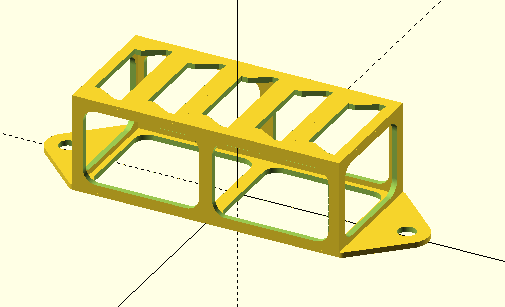
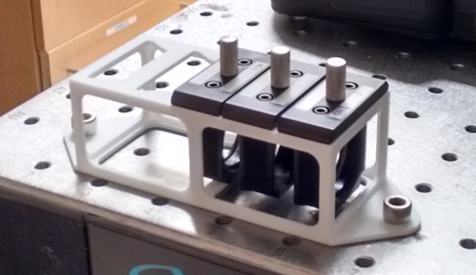

A rack that holds 5 Thorlabs CFH2-F removable filter holders.

Notes:
* It costs about $25 to have [Shapeways](http://http://www.shapeways.com/) print this for you in their *Strong and Flexible Plastic* material.

OpenSCAD Rendering:

Picture (Shapeways Strong and Flexible, White, polished):

